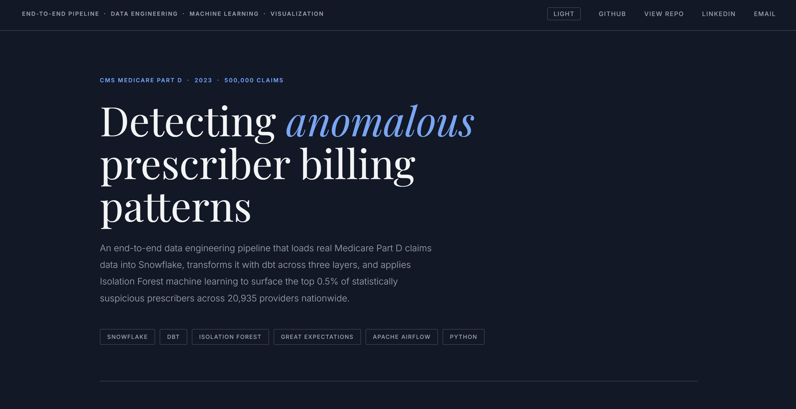
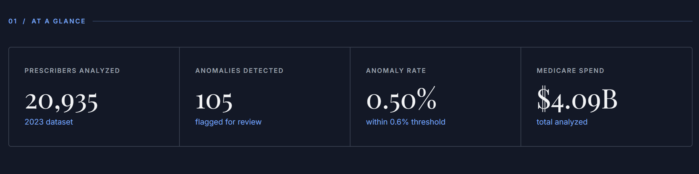
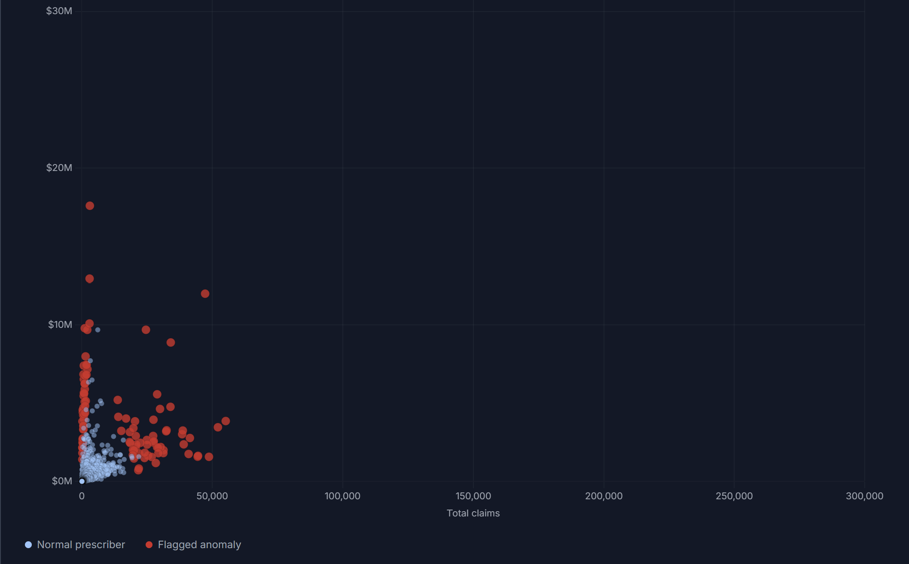
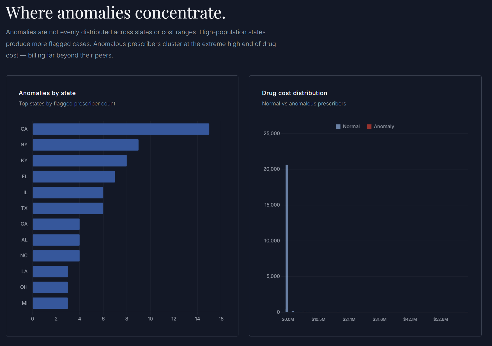
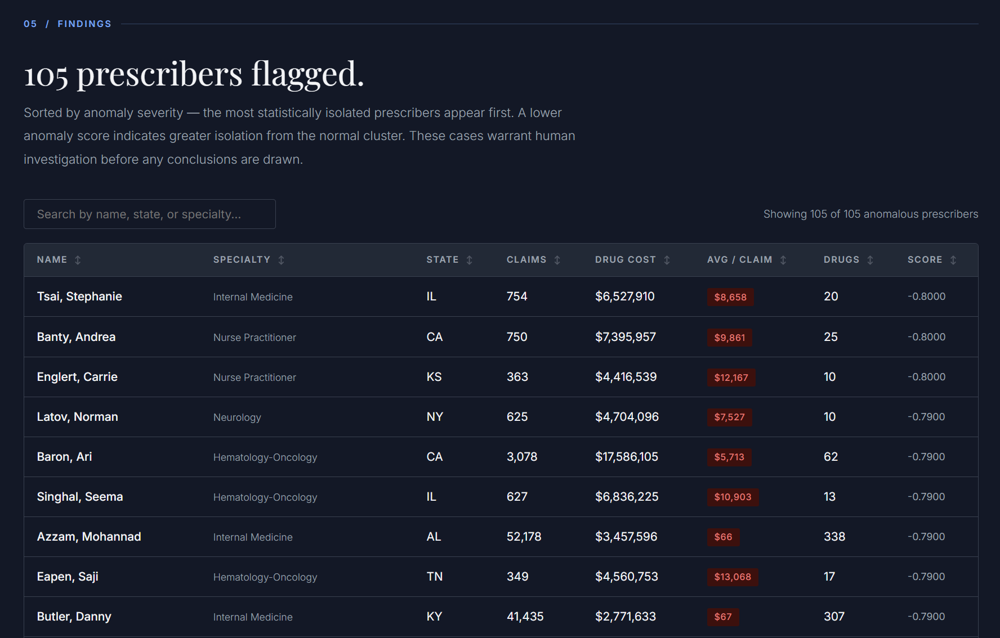
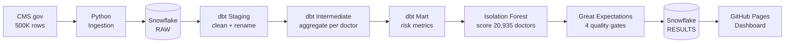
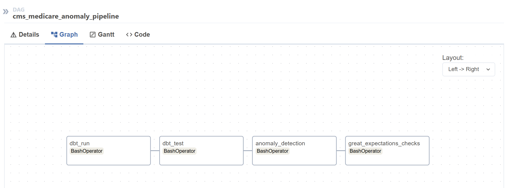
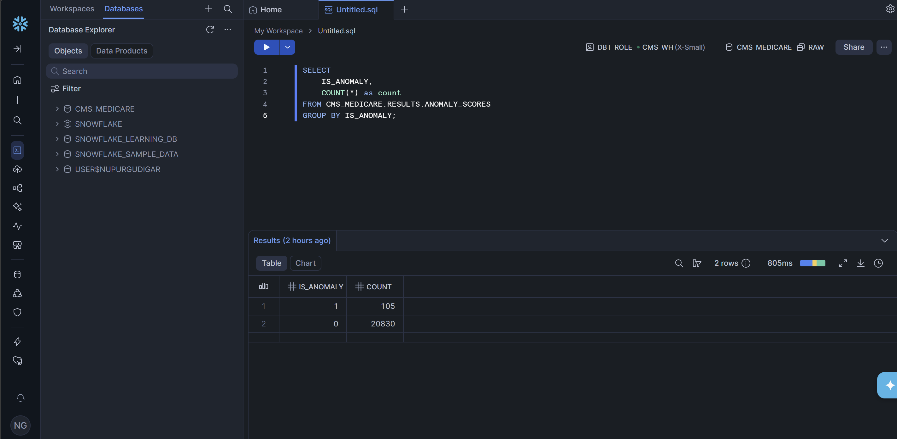

<div align="center">

# CMS Medicare Part D — Anomaly Detection Pipeline

**Detecting suspicious prescriber billing patterns across 20,935 providers using Snowflake, dbt, Isolation Forest, Great Expectations, and Apache Airflow.**

[](https://snowflake.com)
[](https://getdbt.com)
[](https://python.org)
[](https://airflow.apache.org)
[](https://scikit-learn.org)

**[→ View Live Dashboard](https://nupur-gudigar.github.io/cms-anomaly-pipeline)**
&nbsp;&nbsp;|&nbsp;&nbsp;
**[→ Live Data Source](https://data.cms.gov/provider-summary-by-type-of-service/medicare-part-d-prescribers/medicare-part-d-prescribers-by-provider-and-drug)**

</div>

---



---

## What This Is

Medicare Part D is the US government's prescription drug program for seniors. Every year, CMS publishes exactly what every doctor in America prescribed to Medicare patients — how many drugs, how many patients, how much it cost.

This pipeline ingests 500,000 of those records, cleans them through a three-layer dbt architecture, and runs Isolation Forest to surface the 0.5% of prescribers whose billing patterns are statistically impossible to explain as normal.

---

## Results



| | |
|---|---|
| **Prescribers analyzed** | 20,935 |
| **Anomalies detected** | 105 (0.50%) |
| **Medicare spend analyzed** | $4.09 billion |
| **Top flagged case** | Family Practice physician billing $63M — 3.5× more than the highest oncologist |
| **Pipeline runtime** | Under 2 minutes on Snowflake X-Small warehouse |

---

## The Dashboard



Every dot is a doctor. Blue = normal. Red = flagged. The algorithm doesn't look at one number — it evaluates six billing metrics simultaneously and isolates the prescribers who are statistically impossible to explain as normal.



California, New York, and Kentucky lead in flagged prescribers. Anomalous prescribers cluster at the extreme right of the cost distribution — billing far beyond the entire peer group.



105 prescribers sorted by anomaly severity. Searchable, sortable, with avg cost-per-claim highlighted in red for the most suspicious cases.

---

## Pipeline Architecture



## Airflow Orchestration



The entire pipeline is orchestrated as a weekly Airflow DAG running in Docker. If any task fails, everything downstream stops immediately.

dbt_run → dbt_test → anomaly_detection → great_expectations_checks

---

## Snowflake Results



105 anomalous prescribers written to `CMS_MEDICARE.RESULTS.ANOMALY_SCORES` after every pipeline run.

---

## Tech Stack

| Layer | Tool | Why |
|---|---|---|
| Warehouse | Snowflake Standard | Cloud-native, scales to billions of rows |
| Transformation | dbt Core 1.11 | Modular SQL with testing and documentation |
| ML Model | scikit-learn IsolationForest | Unsupervised, no labeled fraud data needed |
| Data Quality | Great Expectations | Pipeline halts on validation failure |
| Orchestration | Apache Airflow 2.8 | Dependency-aware scheduling with retry logic |
| Ingestion | snowflake-connector-python | Bulk CSV → Snowflake loader |
| Dashboard | HTML / Chart.js / GitHub Pages | Lives forever, loads instantly |

---

## dbt Layer Design

**Why three layers?** Each layer has one job. Bugs are easy to isolate. Every layer is independently testable.

staging/
stg_partd_prescribers.sql     ← rename columns, cast types
materialized: view
intermediate/
int_prescriber_summary.sql    ← aggregate to one row per doctor
SUM(claims), SUM(costs), COUNT(DISTINCT drugs)
materialized: table
mart/
fct_prescriber_anomaly_input.sql  ← add derived risk metrics
cost_per_beneficiary, claims_per_drug
materialized: table

**dbt tests passing:**
- `not_null` on prescriber NPI, total claims, total drug cost
- `unique` on prescriber NPI in the mart layer

---

## Why Isolation Forest

Medicare fraud detection is unsupervised — there are no labeled fraudsters to learn from. Isolation Forest works by asking a simple question: *how few random cuts does it take to isolate this prescriber from everyone else?*

Normal doctors cluster together and take many cuts to isolate. Suspicious ones stand alone and get isolated in very few cuts.

Six features feed the model:

| Feature | Signal |
|---|---|
| `total_claims` | Unusual prescription volume |
| `total_drug_cost` | Unusual Medicare spend |
| `total_beneficiaries` | Unusual patient count |
| `unique_drugs_prescribed` | Unusual drug variety |
| `avg_cost_per_claim` | Unusual cost intensity |
| `cost_per_beneficiary` | Unusual spend per patient |

> **Note on false positives:** Statistical anomalies ≠ fraud. Palliative care physicians and rural providers may appear anomalous due to patient population characteristics. This pipeline surfaces cases for human review — not automated conclusions.

---

## Data Quality Gates

Four Great Expectations checks run after every model execution. Any failure halts the pipeline before results reach the dashboard.

| Check | Rule |
|---|---|
| Value set | `IS_ANOMALY` must be 0 or 1 only |
| Not null | `PRESCRIBER_NPI` never null |
| Column mean | Anomaly rate must stay ≤ 0.6% |
| Value range | `TOTAL_DRUG_COST` must be positive |

---

## Project Structure

```
cms-anomaly-pipeline/
│
├── cms_medicare/                  ← dbt project
│   ├── models/
│   │   ├── staging/               ← stg_partd_prescribers.sql
│   │   ├── intermediate/          ← int_prescriber_summary.sql
│   │   └── mart/                  ← fct_prescriber_anomaly_input.sql
│   └── dbt_project.yml
│
├── airflow/
│   ├── dags/                      ← cms_pipeline_dag.py
│   └── docker-compose.yml
│
├── docs/                          ← GitHub Pages dashboard
│   ├── index.html
│   └── data.json
│
├── anomaly_detection.py           ← Isolation Forest model
├── data_quality_checks.py         ← Great Expectations validation
├── export_to_json.py              ← Snowflake → JSON exporter
├── load_to_snowflake.py           ← CSV → Snowflake loader
├── sample_data.py                 ← CMS CSV sampler
└── .env.example                   ← credentials template
```

<div align="center">

**Built by Nupur Gudigar**

MS Computer Science (Data Analytics) · Illinois Institute of Technology
Previously: Infosys / Solvay · Chicago Public Schools · OpenAvenues
Open to Data Engineering and Data Analytics roles · Available July 2025

[LinkedIn](https://www.linkedin.com/in/nupur-gudigar) · [GitHub](https://github.com/Nupur-Gudigar) · [nupurgudigar.tech@gmail.com](mailto:nupurgudigar.tech@gmail.com) · [Live Dashboard](https://nupur-gudigar.github.io/cms-anomaly-pipeline)

</div>